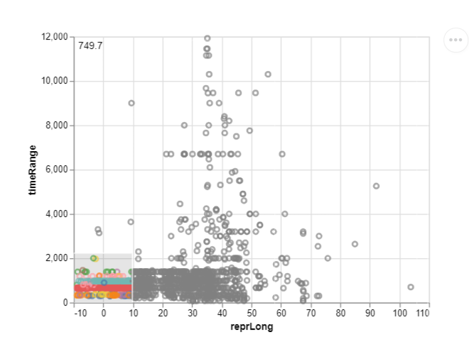

<div style="background-color: #cccccc;">
    <h2 style="background-color: #909090;font-size: 1em;margin-bottom: 0;">What can we learn from the visualization?</h2>
    <div>At what longitude the settlements with the longest period of longevity are located. It is also possible to see
         the average period of the selected settlements with a variable being displayed at the top left of the plot. This shows that the settlements with the longest periods are located in Turkey and the Middle East, while settlements with shorter periods dominate Western Europe.</div>
</div>

<div style="background-color: #cccccc;">
    <h2 style="background-color: #909090;font-size: 1em;margin-bottom: 0;">What is the name for the type of visualization(s) used?</h2>
    <div>Scatter Plot.</div>
</div>

<div style="background-color: #cccccc;">
    <h2 style="background-color: #909090;font-size: 1em;margin-bottom: 0;">What are all visual mappings used?</h2>
    <div>CHANGE THIS</div>
</div>

<div style="background-color: #cccccc;">
    <h2 style="background-color: #909090;font-size: 1em;margin-bottom: 0;">Was there any special data preparation done?</h2>
    <div>A new column was added, named timeRange, which is   the subtraction of maxDate and minDate. Any dataset that wasn't a settlement was dropped. Finally, any settlement that was older than 60000 years ago (which represents the beginning of human civilization) was also dropped.</div>
</div>

<div style="background-color: #cccccc;">
    <h2 style="background-color: #909090;font-size: 1em;margin-bottom: 0;">What are the limitations of your design?</h2>
    <div>the scatter plot only plots the longitude to timeRange, and there is no information provided on the latitude.</div>
</div>




```
import IOReader as io
import altair as alt
from vega_datasets import data

#Opening the dataset

alt.renderers.enable('altair_viewer')
alt.data_transformers.disable_max_rows()
locations_data = io.open_file("pleiades-locations-latest.csv")

#dropping unnecessary data

locations_data['timeRange'] = locations_data['maxDate'] - locations_data['minDate']
locations_data.drop(
    locations_data[locations_data['timeRange'] > 60000].index, inplace=True)
locations_data.drop(locations_data[~(
    locations_data['featureType'] == "settlement")].index, inplace=True)

#selection for interaction

sel = alt.selection_interval()

#chart specification

chart = alt.Chart(locations_data).mark_point().encode(
    x='reprLong:Q',
    y='timeRange',
    color=alt.condition(sel, alt.Color('timePeriodsKeys:N', legend=None), alt.value('gray')),
    tooltip='timePeriodsKeys'
).add_selection(
        sel
)

#average calculation

text = alt.Chart(locations_data).transform_filter(sel).      mark_text(
    align='left',
    baseline='top',
).encode(
    x=alt.value(5),
    y=alt.value(5),
    text=alt.Text('average(timeRange):Q', format='.1f'),
)

#show in Altair Viewer

(chart + text).show()
```
