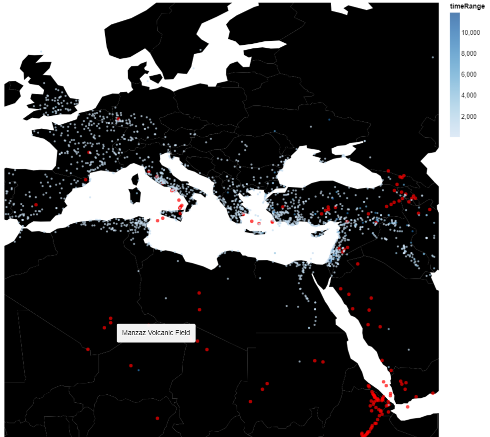
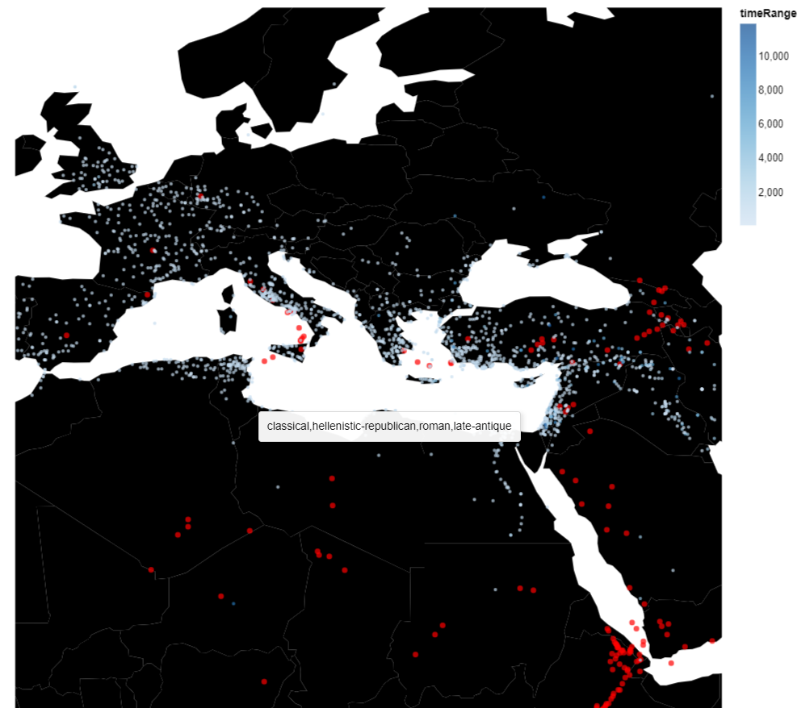

<div style="background-color: #cccccc;">
    <h2 style="background-color: #909090;font-size: 1em;margin-bottom: 0;">What can we learn from the visualization?</h2>
    <div>The aim of this visualization is to show a possible correlation between the longevity of a settlement and its vicinity to a volcano. Volcanos are shown in red, while the colour of the settlements represents their longeivity. It seems that there isn't an obvious pattern appearing in the visualization. In the caucasian region, there is a high density of volcanos and a low density of settlements, which might suggest a possible correlation between the two. However, this might also be due to the region's unforgiving climate. Furthermore, there is a few settlements located near volcanos that have existed for a long period of time. This might suggest that the settlement took advantage of fertile lands around the volcano, or it might just indicate that the volcano was not active.</div>
</div>

<div style="background-color: #cccccc;">
    <h2 style="background-color: #909090;font-size: 1em;margin-bottom: 0;">What is the name for the type of visualization(s) used?</h2>
    <div>Scatter plots placed on top of a geomap.</div>
</div>

<div style="background-color: #cccccc;">
    <h2 style="background-color: #909090;font-size: 1em;margin-bottom: 0;">What are all visual mappings used?</h2>
    <div>
        x position:
        <ul>
            <li>Longitude Category.</li>
        </ul>
        y position:
        <ul>
            <li>Latitude Category.</li>
        </ul>
        colour:
        <ul>
            <li>Time Range Category (for settlements).</li>
            <li> red (for volcanos) </li>
        </ul>
        tooltip:
        <ul>
            <li>Time Periods Keys Category (for settlements).</li>
            <li>V_Name Category (for volcanos).</li>
        </ul>
    </div>
</div>

<div style="background-color: #cccccc;">
    <h2 style="background-color: #909090;font-size: 1em;margin-bottom: 0;">Was there any special data preparation done?</h2>
    <div>The locations of the volcanos was gathered by the dataset available at: https://data.humdata.org/dataset/volcano-population-exposure-index-gvm/resource/e3b1ecf0-ec47-49f7-9011-6bbb7403ef6d. The volcanos are shown in red, while the colour of the settlements represents their longevity. The longevity data is produced by subtracting values from the maxDate column and the minDate column. Settlements that are older than 60000 years were dropped. Samples that aren't settlements were also dropped. Tooltips are provided both for volcanos and settlements. Hovering the mouse over a volcano shows its name, hovering the mouse over a settlement shows its time period.
</div>
</div>

<div style="background-color: #cccccc;">
    <h2 style="background-color: #909090;font-size: 1em;margin-bottom: 0;">What are the limitations of your design?</h2>
    <div>The datasets used are not detailed enough to shoe any obvious pattern. It would be more useful to use a dataset that contains a volcano's activity over time. This way, one could only show volcanos that were active during the time period of the settlements around it. Furthermore, many settlements have low longevity, making it harder to spot differences between them. Furthermore, some areas in the dataset have a really high density of settlements, which might be covering some important information to the viewer.</div>
</div>




```
#Volcano dataset at: https://data.humdata.org/dataset/volcano-population-exposure-index-gvm/resource/e3b1ecf0-ec47-49f7-9011-6bbb7403ef6d

import IOReader as io
import pandas as pd
import altair as alt
import numpy as np
from vega_datasets import data

alt.renderers.enable('altair_viewer')
alt.data_transformers.disable_max_rows()
locationsData = pd.read_csv("pleiades-locations-latest.csv")
volcanoData = pd.read_csv("volcano.csv")
countries = alt.topo_feature(data.world_110m.url, 'countries')

#preprocessing
locationsData['timeRange'] = locationsData['maxDate'] - locationsData['minDate']

#dropping unnecessary data
locationsData.drop(locationsData[~(
    locationsData['featureType'] == "settlement")].index, inplace=True)
locationsData.drop(
    locationsData[locationsData['timeRange'] > 60000].index, inplace=True)

#scaling specification
scaling = alt.selection_interval(bind='scales')

#width and height of window
widthValue = 700
heightValue = 700

#volcano chart specification
volcanoChart = alt.Chart(volcanoData).mark_circle().encode(
    longitude='Longitude',
    latitude='Latitude',
    color = alt.value('red'),
    tooltip = 'V_Name'
).properties(
    width=widthValue,
    height=heightValue,
)

#pleiades chart specification
pleiadesChart = alt.Chart(locationsData).mark_point(
    filled=True,
    size=10
).encode(
    longitude='reprLong',
    latitude='reprLat',
    color='timeRange:Q',
    tooltip = 'timePeriodsKeys'
).properties(
    width=widthValue,
    height=heightValue
)

#geomap parameters
scaleValue = 700
translation = [100, 800]

#geomap specification
mapData = alt.layer(
    alt.Chart(countries).mark_geoshape(fill='black'),
    volcanoChart,
    pleiadesChart
).project(
    type='equirectangular', scale=scaleValue, translate=translation
).properties(width=widthValue, height=heightValue).configure_view(stroke=None)

mapData.show()
```
