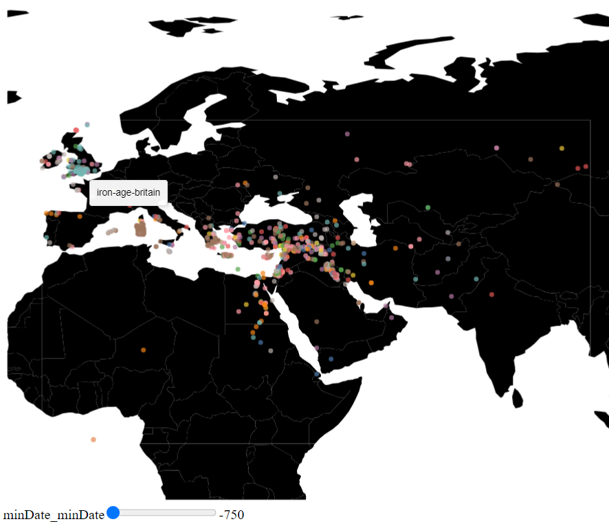
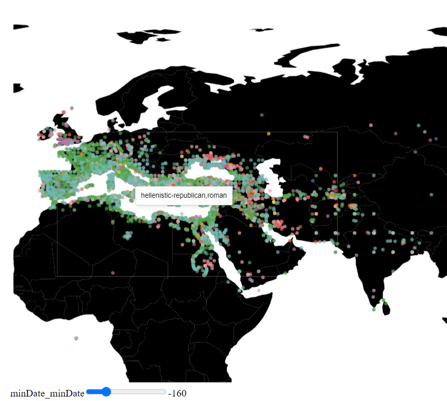
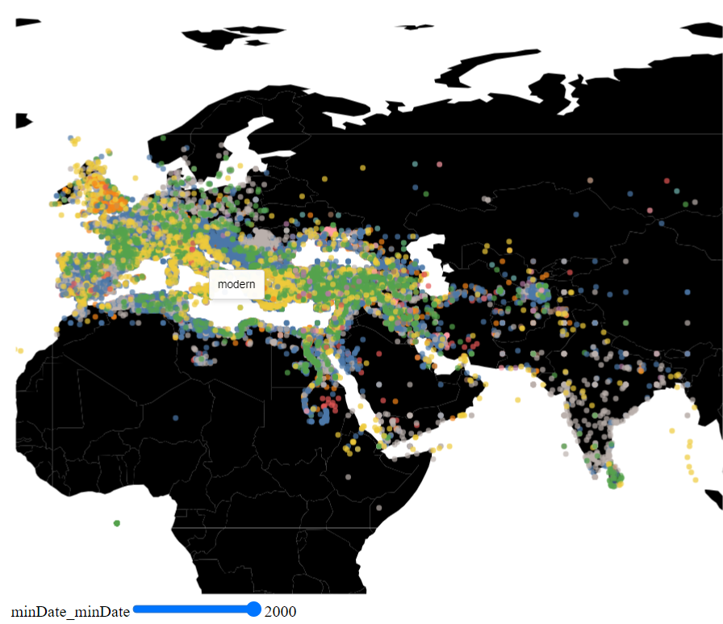

<div style="background-color: #cccccc;">
    <h2 style="background-color: #909090;font-size: 1em;margin-bottom: 0;">What can we learn from the visualization?</h2>
    <div>The aim of this visualization is to see the development of settlements over time. We can see that the number and variety of settlements increases over time. This shows the progress of human civilization over time.</div>
</div>

<div style="background-color: #cccccc;">
    <h2 style="background-color: #909090;font-size: 1em;margin-bottom: 0;">What is the name for the type of visualization(s) used?</h2>
    <div>Geomap with samples located with latitude and longitude.</div>
</div>

<div style="background-color: #cccccc;">
    <h2 style="background-color: #909090;font-size: 1em;margin-bottom: 0;">What are all visual mappings used?</h2>
    <div>
        x position:
        <ul>
            <li>Longitude Category</li>
        </ul>
        y position:
        <ul>
            <li>Latitude Category</li>
        </ul>
        colour:
        <ul>
            <li>Time Periods Keys Category</li>
        </ul>
        tooltip:
        <ul>
            <li>Time Periods Keys Category</li>
        </ul>
    </div>
</div>

<div style="background-color: #cccccc;">
    <h2 style="background-color: #909090;font-size: 1em;margin-bottom: 0;">Was there any special data preparation done?</h2>
    <div>A new column was added, named timeRange, which is   the subtraction of maxDate and minDate. Any settlement located above the equator was dropped. Finally, any settlement that was older than 60000 years ago (which represents the beginning of human civilization) was also dropped.</div>
</div>

<div style="background-color: #cccccc;">
    <h2 style="background-color: #909090;font-size: 1em;margin-bottom: 0;">What are the limitations of your design?</h2>
    <div>The data that is linked to the slider is not continuous, so there are steps in which nothing changes, and steps where the information on the screen changes dramatically. Furthermore, the density of samples allows samples to cover each other, decreasing the amount of information that can be shown effectively.</div>
</div>





```
import IOReader as io
import altair as alt
from vega_datasets import data

alt.renderers.enable('altair_viewer')
alt.data_transformers.disable_max_rows()
dataset = io.open_file("pleiades-locations-latest.csv")

countries = alt.topo_feature(data.world_110m.url, 'countries')

#preprocessing
dataset['timeRange'] = dataset['maxDate'] - dataset['minDate']
dataset.drop(
    dataset[dataset['timeRange'] > 60000].index, inplace=True)
dataset.drop(
    dataset[dataset['reprLat'] < 0].index, inplace=True)


#width and height of window
widthValue = 700
heightValue = 700

#slider
minDateSlider = alt.binding_range(min=-750, max=2000, step=10)
minDateSel = alt.selection_single(name="minDate", fields=['minDate'],
                                   bind=minDateSlider, init={'minDate': -750})

#chart specification
chart = alt.Chart(dataset).mark_circle().encode(
    longitude='reprLong',
    latitude='reprLat',
    color=alt.Color('timePeriodsKeys:N', legend=None),
    tooltip = 'timePeriodsKeys'
).properties(
    width=widthValue,
    height=heightValue,
).add_selection(
    minDateSel
).transform_filter(
    alt.datum.minDate < minDateSel.minDate
)

#geomap parameters
scaleValue = 350
translation = [100, 630]

#geomap specification
mapData = alt.layer(
    alt.Chart(countries).mark_geoshape(fill='black'),
).project(
    type='equirectangular', scale=scaleValue, translate=translation
).properties(width=widthValue, height=heightValue).configure_view(stroke=None)

(mapData + chart).show()
```
