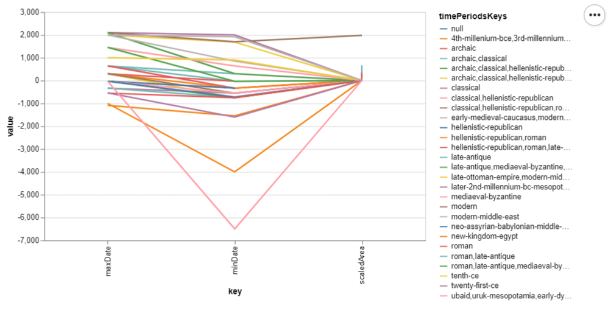

<div style="background-color: #cccccc;">
    <h2 style="background-color: #909090;font-size: 1em;margin-bottom: 0;">What can we learn from the visualization?</h2>
    <div>The aim of this visualization is to show the relationship between settlements of different time periods, in terms of their location, surface area, dates.We can see that most settlements have a similar surface area, and there is relatively little variation in terms of location. the periods in which each settlement lived changes dramatically.</div>
</div>

<div style="background-color: #cccccc;">
    <h2 style="background-color: #909090;font-size: 1em;margin-bottom: 0;">What is the name for the type of visualization(s) used?</h2>
    <div>Parallel Coordinates.</div>
</div>

<div style="background-color: #cccccc;">
    <h2 style="background-color: #909090;font-size: 1em;margin-bottom: 0;">What are all visual mappings used?</h2>
    <div>CHANGE THIS</div>
</div>

<div style="background-color: #cccccc;">
    <h2 style="background-color: #909090;font-size: 1em;margin-bottom: 0;">Was there any special data preparation done?</h2>
    <div>A new column was added, named timeRange, which is   the subtraction of maxDate and minDate. Any settlement that was older than 60000 years ago (which represents the beginning of human civilization) was dropped. Any settlement located above the equator was dropped. Furthermore, 4 more columns were added by separating the contents of the bbox column. This was done on Excel by following the tutorial at https://www.youtube.com/watch?v=QKM7q4fHYOU . These 4 columns were then used to calculate the surface area of each settlement. Settlements with a surface area of zero were then dropped. Moreover, the areas and coordinates of each settlement were rescaled so that the variation of those values would be more visible on the visualization. The amount of data on the screen was decreased to make the visualization cleaner and easier to read. This was done by removing all samples with a timePeriods value that had more than one character. This means we only retain settlements that are clearly identified by one time period. Finally, the y axis of the visualization is the average values of all settlements in the same time period.</div>
</div>

<div style="background-color: #cccccc;">
    <h2 style="background-color: #909090;font-size: 1em;margin-bottom: 0;">What are the limitations of your design?</h2>
    <div>The relationships between axis that are visible greatly depend on the order in which the axis are presented. If the user were able to change the order of the axis, more interesting patterns could appear. Furthermore, because the values for area and coordinates needed to be rescaled, it's hard to relate them to their original values. Finally, to make the visualization cleaner, a lot of data needed to be dropped, which may have revealed other patterns in the dataset.</div>
</div>



```
#excel reference at: https://www.youtube.com/watch?v=QKM7q4fHYOU

import IOReader as io
import pandas as pd
import altair as alt
from vega_datasets import data

alt.renderers.enable('altair_viewer')
alt.data_transformers.disable_max_rows()
df = pd.read_csv("pleiades-locations-latest.csv")

#the following values are approximations and they may vary
#depending on the position on the planet.
distanceBetweenLatitudes = 111000
distanceBetweenLongitudes = 97000

df['timeRange'] = df['maxDate'] - df['minDate']
df.drop(
    df[df['timeRange'] > 60000].index, inplace=True)

df['area'] = (df['topRightX'] - df['bottomLeftX']) * (df['topRightY'] - df['bottomLeftY'])

#rescaling area
maxArea = df['area'].max()
minArea = df['area'].min()

originalRange = maxArea - minArea

scaledMax = 3000
scaledMin = 0

scaledRange = scaledMax - scaledMin

df['scaledArea'] = (((df['area'] - minArea) * scaledRange) / originalRange) + scaledMin

#rescaling reprLat
maxReprLat = df['reprLat'].max()
minReprLat = df['reprLat'].min()

originalRange = maxReprLat - minReprLat

scaledMax = 3000
scaledMin = 0

scaledRange = scaledMax - scaledMin

df['scaledReprLat'] = (((df['reprLat'] - minReprLat) * scaledRange) / originalRange) + scaledMin

#rescaling reprLong

maxReprLong = df['reprLong'].max()
minReprLong = df['reprLong'].min()

originalRange = maxReprLong - minReprLong

scaledMax = 3000
scaledMin = 0

scaledRange = scaledMax - scaledMin

df['scaledReprLong'] = (((df['reprLong'] - minReprLong) * scaledRange) / originalRange) + scaledMin

#dropping unnecessary data

df.drop(df[df['scaledArea'] == 0].index, inplace=True)
df = df[df['timePeriodsKeys'].str.split(",").str.len().lt(2)]

#chart specification
chart = alt.Chart(df).transform_window(
    index='count()'
).transform_fold(
    ['scaledArea', 'maxDate', 'minDate', 'scaledReprLat', 'scaledReprLong']
).mark_line().encode(
    x='key:N',
    y='average(value):Q',
    color='timePeriods'
).properties(width=500)

chart.show()
```
