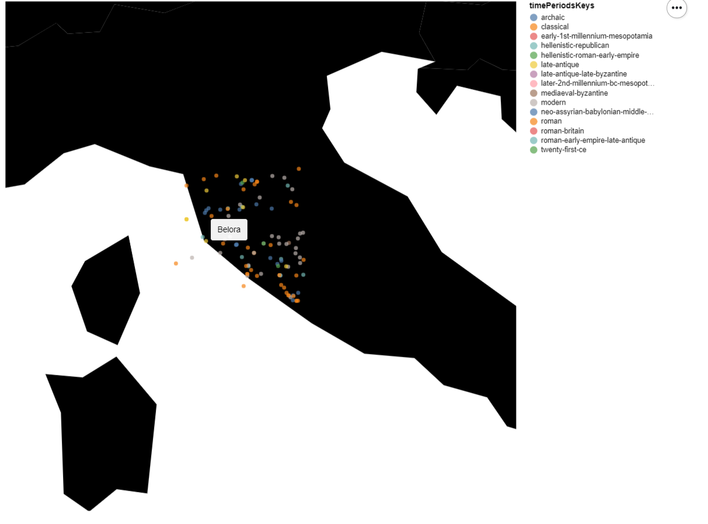

<div style="background-color: #cccccc;">
    <h2 style="background-color: #909090;font-size: 1em;margin-bottom: 0;">What can we learn from the visualization?</h2>
    <div>The aim of this visualization is to see patterns of settlements from different time periods in Tuscany, Italy. We can see that roman settlements have had a lot of influence in the region. Moreover, modern settlements are mostly located in the eastern part of Tuscany. Finally, we can see that the dataset does not identify Etrurian settlements as Etrurian. Places like "Belvedere Tomb" and "Tomba della Montagnola" are identified under the umbrella term of "archaic" instead.</div>
</div>

<div style="background-color: #cccccc;">
    <h2 style="background-color: #909090;font-size: 1em;margin-bottom: 0;">What is the name for the type of visualization(s) used?</h2>
    <div>Geomap with samples located with latitude and longitude.</div>
</div>

<div style="background-color: #cccccc;">
    <h2 style="background-color: #909090;font-size: 1em;margin-bottom: 0;">What are all visual mappings used?</h2>
    <div>CHANGE THIS</div>
</div>

<div style="background-color: #cccccc;">
    <h2 style="background-color: #909090;font-size: 1em;margin-bottom: 0;">Was there any special data preparation done?</h2>
    <div>all settlements that weren't near the region of Tuscany were dropped. Furthermore, settlements that aren't clearly identified by one time period were dropped.</div>
</div>

<div style="background-color: #cccccc;">
    <h2 style="background-color: #909090;font-size: 1em;margin-bottom: 0;">What are the limitations of your design?</h2>
    <div>Not all samples in the visualization are in Tuscany, as it was not possible to only select settlements in that region. For example, "Galeata" (which is visible in the visualization) is not in Tuscany, but it is in the neighbouring region of Emilia Romagna.</div>
</div>



```
#Siena UID = 62adf57abfdf2645abe652f7caa19880
#Siena ID = 413293
#Siena connectsWith = 702,604,147,136,661,000
#Siena coordinates (lat, long) = 43.318695,11.330502

import pandas as pd
import altair as alt
import numpy as np
from vega_datasets import data

#loading data
alt.renderers.enable('altair_viewer')
alt.data_transformers.disable_max_rows()
df = pd.read_csv("pleiades-places-latest.csv")

#geomap
countries = alt.topo_feature(data.world_110m.url, 'countries')

#dropping samples outside of Tuscany
df.drop(df[df['reprLat'] < 42].index, inplace=True)
df.drop(df[df['reprLat'] > 44].index, inplace=True)

df.drop(df[df['reprLong'] < 10].index, inplace=True)
df.drop(df[df['reprLong'] > 12].index, inplace=True)

#dropping samples that aren't clearly identified by one time period
df = df[df['timePeriodsKeys'].str.split(",").str.len().lt(2)]

#window height and width
widthValue = 700
heightValue = 700

#chart specifications
chart = alt.Chart(df).mark_circle().encode(
    longitude='reprLong',
    latitude='reprLat',
    color='timePeriodsKeys',
    tooltip='title'
)

#geomap parameters
scaleValue = 5300
translation = [-700, 4300]

#geomap specification
mapData = alt.layer(
    alt.Chart(countries).mark_geoshape(fill='black'),
).project(
    type='equirectangular', scale=scaleValue, translate=translation
).properties(width=widthValue, height=heightValue).configure_view(stroke=None)

(mapData + chart).show()

```
